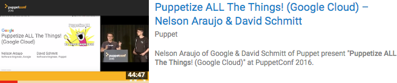

# About This Repo

Hosts all puppet manifests and related files used during the
[Puppet Conf 2016][sched] demo for the Google <=> Puppet integration:

[Puppetize ALL The Things! (Google Cloud)][talk-video] (video)
  – Nelson Araujo & David Schmitt

## What are we setting up?

![Final Deployment Setup][final-setup]

### Service Dependencies

All these services together have a lot of dependencies. Gladly Puppet + Google
modules make those easy to stitch together:

![Service Deps][deps-services]

![Module Deps][deps-modules]

## But I don't see them! Where are the files then?

The files for PuppetConf 2016 will be made available after the first wave of
releases of the infrastructure code it depends. Current ETA for such libraries
is July 2017.

Thanks for the patience.

[final-setup]: images/migration_onpremise_cloud.png
[deps-modules]: images/phases-mod-white.png
[deps-services]: images/phases-svc-white.png
[sched]: http://sched.co/6fj8
[talk-video]: https://youtu.be/5V6ZubtLBE8
